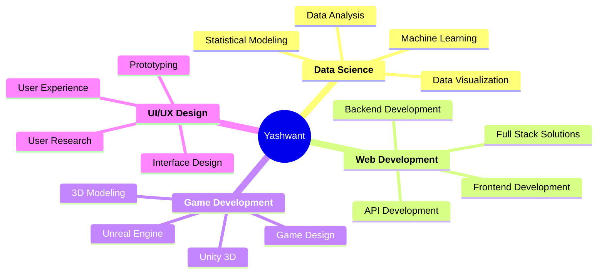

<!--
████████████████████████████████████████████████████████████████████████████████
█─▄▄▄─█▄─▄▄▀█▄─▄▄─██▄─▄▄▀█▄─▄█▄─▄▄─█─▄▄─█─█─█▄─▄▄─██▀▄─██─▄▄▄▄█▄─█─▄█─██─██▄─▄▄▀█
█─██▄─██─▄─▄██─▄█▀██─▄─▄██─███─▄▄▄█─██─█─█─██─▄█▀██─▀─██▄▄▄▄─██▄─▄▄██─█▄███─██─▄─▄█
▀▄▄▄▄▄▀▄▄▄▄▄▀▄▄▄▄▄▀▄▄▄▄▄▀▄▄▄▀▄▄▄▀▀▀▄▄▄▄▀▀▄▄▄▀▄▄▄▄▄▀▄▄▀▄▄▀▄▄▄▄▄▀▀▄▄▄▀▀▀▀▄▀▄▄▄▄▄▀▄▄▄▄▄▀
-->

<div align="center">
  
</div>

<div align="center">
  
[](https://git.io/typing-svg)

</div>

<div align="center">
  
</div>

<br/>

<div align="center">

### 🚀 About Me

</div>

```javascript
class YashwantBhosle {
    constructor() {
        this.name = "Yashwant Bhosle";
        this.roles = ["Data Analyst", "Full Stack Developer", "ML Enthusiast", "UI/UX Designer"];
        this.location = "India 🇮🇳";
        this.passion = "Building intelligent applications";
        this.motto = "Building the future, one line at a time";
    }

    getSkills() {
        return {
            languages: ["Python", "JavaScript", "SQL", "C#"],
            webDev: ["React.js", "Node.js", "HTML5", "CSS3"],
            dataScience: ["Pandas", "NumPy", "Tableau", "Power BI"],
            databases: ["PostgreSQL", "MongoDB", "MySQL"],
            tools: ["Git", "Docker", "Unity", "Blender"],
            cloud: ["AWS", "Azure", "GCP"],
            aiml: ["TensorFlow", "Scikit-learn", "OpenCV"]
        };
    }

    getCurrentFocus() {
        return [
            "🔭 Building intelligent web applications",
            "📊 Creating data visualization dashboards", 
            "🎮 Developing immersive game experiences",
            "🤖 Exploring AI/ML innovations",
            "🎨 Crafting beautiful UI/UX designs"
        ];
    }
}

const yashwant = new YashwantBhosle();
console.log(yashwant.getCurrentFocus());
```

---

<div align="center">

### 🎯 What I'm Up To

</div>

<table align="center">
<tr>
<td width="50%">

#### 🔭 Currently Working On
- **AI-Powered Analytics Platform** - Building intelligent dashboards
- **React.js Portfolio Website** - Modern responsive design
- **Unity 3D Game Project** - Immersive gameplay experience
- **Machine Learning Models** - Predictive analytics solutions

#### 🌱 Currently Learning
- **Advanced Machine Learning** - Deep Learning & Neural Networks
- **Cloud Architecture** - AWS & Azure services
- **Microservices** - Scalable system design
- **DevOps Practices** - CI/CD & containerization

</td>
<td width="50%">

#### 🎪 Fun Facts About Me
- 🎮 **Game Dev Enthusiast** - Creating worlds in Unity & Unreal
- 📊 **Data Visualization Artist** - Making data tell stories
- 🎨 **UI/UX Perfectionist** - Pixel-perfect designs
- 🧠 **AI Explorer** - Always experimenting with new models
- ☕ **Coffee Powered** - Debugging with caffeine
- 🏔️ **Adventure Seeker** - Hiking trails & exploring nature

</td>
</tr>
</table>

---

<div align="center">

### 🛠️ Tech Arsenal

</div>

<div align="center">

#### 💻 Programming Languages
<p>
  
</p>

#### 🌐 Web Development
<p>
  
</p>

#### 📊 Data Science & Analytics
<p>
  
  
  
  
  
  
</p>

#### 🗄️ Databases
<p>
  
</p>

#### 🤖 AI/ML & Game Development
<p>
  
</p>

#### ☁️ Cloud & DevOps
<p>
  
</p>

#### 🎨 Design & Tools
<p>
  
</p>

</div>

---

<div align="center">

### 🤝 Let's Connect & Collaborate

</div>

<div align="center">

[](https://www.linkedin.com/in/yashwant-bhosle-proxy/)
[](https://github.com/ProooXyyy)
[](https://yashwant-portfolio.com)
[](mailto:bhosleyash18@gmail.com)

</div>

<div align="center">

### 💼 Open for Opportunities

</div>

<div align="center">



</div>

---

<div align="center">

### 🎨 Skills Visualization

</div>

<div align="center">
  
</div>

<div align="center">

**🚀 Always ready to collaborate on innovative projects!**

**💡 Passionate about turning complex data into actionable insights**

**🎯 Dedicated to creating seamless user experiences**

</div>

---

<div align="center">

### 📬 Get In Touch

</div>

<div align="center">

**"Building the future, one line of code at a time"**

💬 **Ask me about:** Data Analysis, Web Development, Game Dev, AI/ML, UI/UX Design

📫 **How to reach me:** [LinkedIn](https://www.linkedin.com/in/yashwant-bhosle-proxy/) | [GitHub](https://github.com/ProooXyyy) | [Email](mailto:bhosleyash18@gmail.com)

⚡ **Fun fact:** I can debug code and design beautiful UIs with equal passion!

</div>

<div align="center">
  
</div>

---

<div align="center">

<sub>⭐️ **Star my repositories if you find them interesting!** ⭐️</sub>

</div>
